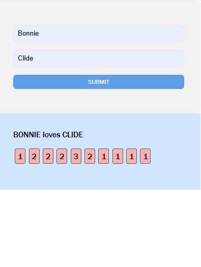
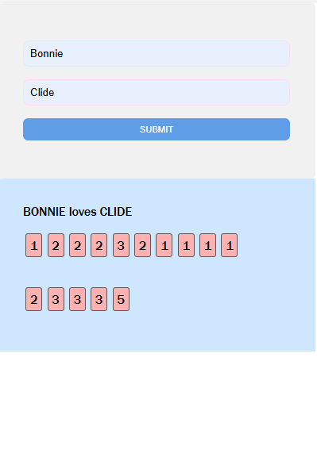
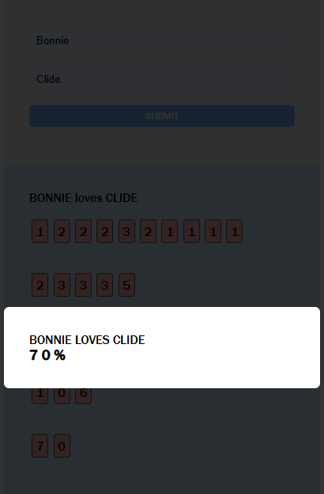

# ❤️ Love Calculator

A fun web app that calculates a "love compatibility" percentage between two names using a recursive character frequency algorithm. Built with vanilla JavaScript and a clean, modular design.

## 🌟 Features

- Accepts two names as input  
- Sanitizes and combines them with the word `"loves"`  
- Counts character occurrences  
- Recursively sums the counts to reduce them to a final percentage  
- Displays the result dynamically on the page  
- Lightweight, responsive, and easy to extend or style

---

## 📸 Preview
-first demonstration(calculation process)


-second demonstration(calculation process)


-last demonstration(results)


---

## 🚀 How It Works

1. **Input**: User enters two names.  
2. **Sanitization**: The names are combined with `"loves"` and all non-letter characters are removed.  
3. **Character Counting**: Frequency of each unique character is counted.  
4. **Recursive Summation**:  
    - The counts are converted into a string of digits.  
    - Digits are summed from the outermost pairs inward.  
    - Repeated until only two digits remain.  
5. **Result Display**: The resulting number is shown as a percentage of love compatibility.

---

## 🧠 Algorithm Example

For `John` and `Jane`:

```
"johnlovesjane" → sanitized → "johnlovesjane"
Character count: j(2), o(2), h(1), n(2), l(1), v(1), e(2), s(1), a(1)
Counts: 2 2 1 2 1 1 2 1 1 → "221211211"
Recursive summation:
  2+1, 2+1, 1+2, 2+1, (1) → [3, 3, 3, 3, 1] → "33331"
  3+1, 3+3, (3) → [4, 6, 3] → "463"
  4+3, (6) → [7, 6] → "76"
Result = 76%
```

---

## 🛠 Technologies

- **HTML** — Basic structure  
- **CSS** — Minimal styling (customizable)  
- **JavaScript (Vanilla)** — Core logic, DOM interaction, and event handling

---

## 🧪 Testing

The logic is modularized for future testing. You can export and test core functions like:

```js
calculateLovePercentage("John", "Jane"); // returns "76"
```

Unit testing with tools like **Jest** is recommended for function validation.

---

## 🧩 Folder Structure

```
📁 love-calculator/
├── index.html
├── style.css
├── app.js
└── README.md
```

---

## 📦 Installation

To run locally:

```bash
git clone https://github.com/mpho-shabalala/love-calculator.git
cd love-calculator
open index.html
```

No build step needed — it’s pure HTML/JS.

---

## ✨ Customization Ideas

- Add name history or local storage for past calculations  
- Improve UX with animations or emojis  
- Integrate with backend for matchmaking stats  
- Turn into a mobile-first PWA

---

## 🧑‍💻 Author

**Your Name**  
Made with ❤️ and JavaScript.

---

## 📄 License

This project is licensed under the MIT License — feel free to use and remix it!
